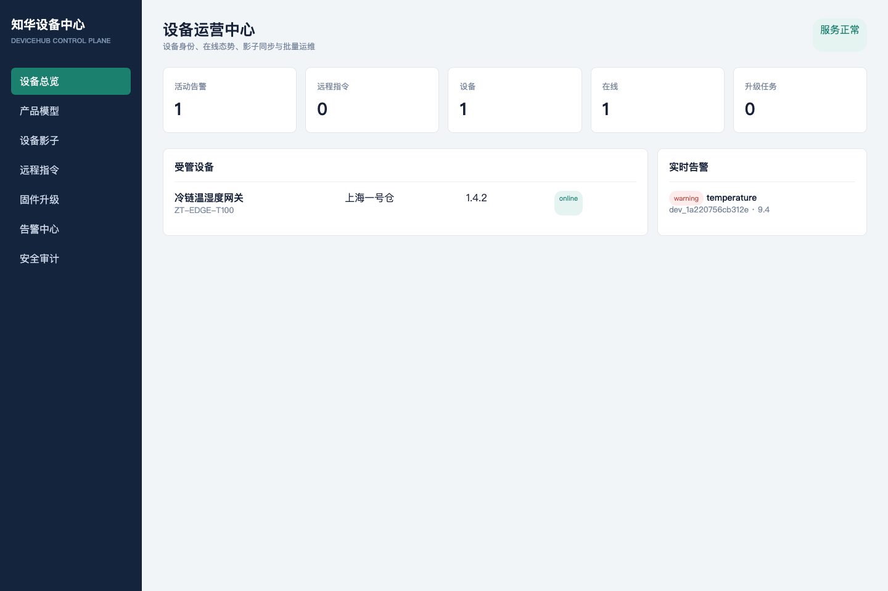

# ZhuaTech DeviceHub · 知华企业设备中心

`zhuatech-devicehub` 是面向企业物联网终端、边缘设备与智能硬件的设备生命周期控制面，采用 Go 构建。它与单纯“设备表格后台”不同，已经实现设备注册身份、期望/上报影子、遥测阈值告警、幂等远程指令和分批固件发布。

维护方：[知华科技（上海如静知华信息科技有限公司）](https://www.zhuatech.cn/)；商业授权与设备接入定制请微信添加 `zhuatech` 或 `zhuatech2`。



## 核心链路

1. 使用一次性注册令牌登记设备，平台只保存设备密钥摘要。
2. 运维人员写入设备影子的 `desired`，设备心跳上报 `reported` 并取得差异。
3. 遥测指标通过产品阈值生成 warning/critical 告警。
4. 远程命令使用幂等键避免网络重试造成重复执行。
5. 固件任务保存 SHA 校验值并按批次推进，适合灰度升级。

## 运行与测试

```bash
go test ./...
DEVICEHUB_API_KEY=zhuatech-demo-key go run ./cmd/server
```

访问 `http://127.0.0.1:18082/`。无 Go 环境时可执行 `docker compose up --build`。接口需 `x-api-key` 请求头。

企业部署应将 JSON 快照替换成 MySQL/PostgreSQL，将遥测写入时序数据库并接入 MQTT Broker；这些属于明确的适配边界，核心状态机不依赖具体基础设施。

## 许可

仅限个人学习、研究和交流，不得商用。企业生产、SaaS、项目交付、收费服务等用途必须取得上海如静知华信息科技有限公司书面授权。本仓库是带非商业限制的社区源码项目，不属于 OSI 定义的开源软件。

## 微信咨询

| 微信号 `zhuatech` | 微信号 `zhuatech2` |
| --- | --- |
|  |  |
